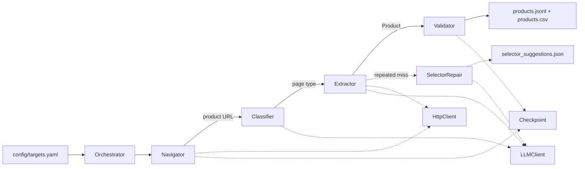
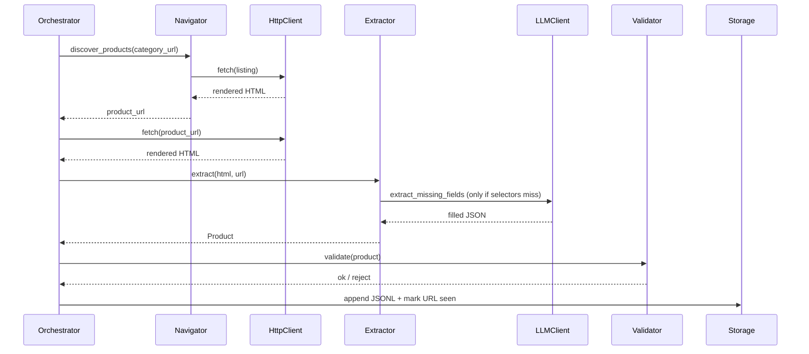

# Frontier Dental — AI Agent Product Scraper (POC)

Take-home test: build an agent-based scraping system that extracts a structured
catalog from [Safco Dental Supply](https://www.safcodental.com/), with
production-minded controls (rate limiting, retries, checkpointing, observability)
and selective use of LLMs as fallback rather than primary extraction.

---

## 1. Architecture overview

The orchestrator drives a single async run. Each agent has a narrow
responsibility and a clean async boundary, so implementations can be
swapped (Playwright→httpx, Gemini→Claude) without changing the core
flow.

### 1.1 Component view



Solid arrows are primary data flow; dotted arrows are side calls to
shared infrastructure or async feedback loops.

### 1.2 Sequence — extracting one product



**SelectorRepair operates as an offline feedback loop**: when a CSS
selector misses repeatedly across products, it asks the LLM for
replacement suggestions and writes them to a review queue rather than
auto-deploying — a deliberate production-safety choice.

---

## 2. Why I chose this approach

**Rule-first, LLM-as-fallback.** A naive solution feeds every page
to an LLM and asks for structured output. That works but is slow,
expensive, and non-deterministic. On a Magento-templated site like
Safco, ~95% of products follow the same selector pattern. So:

- CSS selectors handle the happy path (free, ~10ms per page).
- LLM kicks in only when selectors miss critical fields (cost-bounded
  by `max_calls_per_run`).
- A separate **SelectorRepair** agent watches for repeated failures
  and asks the LLM to *suggest replacement selectors* — but writes
  them to a review file rather than auto-deploying. That's a deliberate
  production-safety choice: auto-deploying LLM-generated CSS is risky.

**Playwright over plain HTTP.** Safco's product grid is JS-rendered
(I confirmed by fetching the URL and seeing an empty `.product-items`
container in the static HTML). Playwright's `wait_for_selector` ensures
the rendered DOM is stable before we scrape.

**Pydantic schema as the contract.** Every output row passes through
`Product.model_validate()` so a downstream consumer (DB load, search
index) gets a known shape. The `extraction_method` and
`fields_via_llm` fields create an audit trail for quality monitoring.

---

## 3. Agent responsibilities

| Agent | Strategy | LLM use |
|---|---|---|
| **Navigator** | Crawl category page, extract product URLs, walk pagination | None (pure rules) |
| **Classifier** | URL pattern + DOM signals → `category_listing` / `product_detail` / `other` | Fallback when rules are inconclusive |
| **Extractor** | CSS selectors → Pydantic Product. Identifies missing critical fields | Fills gaps via JSON-mode prompt asking only for missing fields |
| **Validator** | Schema check + dedup by SKU/URL + business rules | None |
| **SelectorRepair** | Tracks per-field selector failures; on threshold, persists candidate replacement selectors for human review | Suggests new CSS selectors |

---

## 4. Setup & execution

```bash
# 1. Clone + venv
git clone <this-repo> && cd "frontier dental test"
python -m venv venv && source venv/Scripts/activate   # Windows: .\venv\Scripts\activate
pip install -r requirements.txt
playwright install chromium

# 2. Configure
cp .env.example .env
# Edit .env and set GEMINI_API_KEY (free tier: https://aistudio.google.com/app/apikey)
# If you skip this, the system runs in pure rule-based mode (no LLM fallback)

# 3. Run scrape
python -m src.main scrape --config config/targets.yaml

# 4. Inspect status
python -m src.main status

# 5. Re-export CSV
python -m src.main export
```

Output lands in:
- `data/output/products.jsonl` — canonical per-product records
- `data/output/products.csv` — flat export
- `data/output/selector_suggestions.json` — SelectorRepair candidates
- `data/checkpoints/seen.json` — resumable URL list
- `logs/run.log` — rotated structured log

A re-run picks up where the previous one left off (URLs in `seen.json`
are skipped). Idempotent on SKU.

---

## 5. Sample output schema

```json
{
  "name": "MICROFLEX MidKnight Black Nitrile Powder-Free Exam Gloves, Medium",
  "url": "https://www.safcodental.com/catalog/microflex-mk-296-medium.html",
  "category_path": ["Dental Exam Gloves"],
  "brand": "Microflex",
  "sku": "MK-296-M",
  "price": 12.99,
  "currency": "USD",
  "pack_size": "100/box",
  "availability": "in_stock",
  "description": "Powder-free, latex-free nitrile exam glove. Black. Textured fingertips.",
  "specifications": {
    "Material": "Nitrile",
    "Color": "Black",
    "Size": "Medium",
    "Powder": "No"
  },
  "image_urls": [
    "https://www.safcodental.com/media/catalog/product/m/k/mk-296.jpg"
  ],
  "alternative_skus": [],
  "extracted_at": "2026-05-06T18:34:12.913456+00:00",
  "extraction_method": "selector",
  "extraction_confidence": 1.0,
  "fields_via_llm": []
}
```

CSV mirrors the schema; nested fields (lists, dicts) are JSON-encoded
to keep one product per row.

---

## 6. Limitations

- **`max_products_per_category` cap** in config — keeps the POC bounded
  during the 24h test. Lift for full crawls.
- **No `robots.txt` checker** — production must add this. Safco's
  robots.txt was not blocking on the sampled paths but a real system
  needs explicit compliance.
- **Product variants not modeled** — if one product has size/color
  variants on a single detail page, only the default is captured.
  Real schema would extend `Product` with a `variants: list[Variant]`.
- **No `alternative products` extraction** — the related-products
  carousel on detail pages is not parsed (could be added with another
  selector + child extraction).
- **Single browser context** — for very large crawls you'd want a
  context pool so different sessions don't bleed cookies.
- **LLM cost cap is per-run, not per-budget** — a long-running deployment
  needs a token/dollar budget rather than a call count.
- **No Cloudflare / bot challenge handling** — Safco didn't surface
  one during testing; if introduced, would need stealth playwright +
  proxy rotation.

---

## 7. Failure handling

| Failure | Detection | Response |
|---|---|---|
| Network / 5xx | Tenacity exception | Exponential-backoff retry up to `crawler.retries` |
| `wait_for_selector` timeout | Logged; HTML still captured | Extractor may still find data; if not, LLM fallback engages |
| Selector miss for one field | `_first_text` returns None | LLM fallback (extractor) requested for that field |
| Selector miss across many pages | `SelectorRepair.record_failure` count | After threshold, repair agent suggests replacement selector to JSON file |
| Pydantic validation reject | Caught in extractor, logged | Product dropped, URL still checkpointed (won't retry the bad page in the next run) |
| LLM call cap reached | Counter check | Returns empty dict, downstream proceeds with whatever selectors got |
| Crash mid-run | `CheckpointStore` is flushed atomically per URL | Rerun resumes from last checkpoint |

---

## 8. How to scale to full-site crawling in production

1. **Distributed queue.** Replace the single in-process navigator with
   Redis (or SQS) holding the URL frontier. Multiple workers pop
   URLs concurrently.
2. **Sharded checkpoint.** Move `seen.json` into Postgres or DynamoDB
   keyed by URL hash for O(1) `is_seen` across workers.
3. **Browser pool.** Run `N` Playwright contexts behind a pool — most
   real sites tolerate 5–10 concurrent connections from a single
   crawler IP.
4. **Proxy rotation.** Add a residential / datacenter proxy pool to
   spread the load. Respect each site's terms.
5. **Schedule.** Wrap each category run as an Airflow / Dagster task
   with cron schedule. Differential crawl (only re-fetch products
   whose `last-modified` advanced or whose dependent pages changed)
   keeps cost down.
6. **Storage upgrade.** JSONL → Postgres for queryability + a vector
   index (e.g. FAISS or pgvector) on product embeddings for
   semantic-search powered downstream features.
7. **Selector versioning.** SelectorRepair candidates land in a
   review queue (not auto-deployed). A human approves; the new
   selector is committed; CI runs regression tests against a sample
   of historical pages.
8. **Observability.** Emit per-page metrics to Prometheus
   (latency, status, selector hit rate, LLM fallback rate, validation
   reject reasons). Alert on field-coverage drops.

---

## 9. How to monitor data quality

- **Schema validation pass rate.** Pydantic rejects per 1000 rows.
  Trends up → site format changed.
- **Per-field coverage.** `% rows with non-null sku`, `% with price`,
  etc. A sudden drop signals selector breakage.
- **LLM fallback rate.** If the proportion of `extraction_method =
  hybrid` or `llm_fallback` rises, the rule-based selectors are
  drifting. SelectorRepair suggestions tell you where.
- **Validator dedup rate.** Spike in `rejected_duplicate` may indicate
  pagination issues (same products on multiple pages).
- **Distribution drift.** Track price quantiles, image-count
  distribution, brand frequency. A sharp shift in any of these vs.
  the prior run = either site changed or our extractor is buggy.
- **Sample audits.** Random-sample N rows per run for human review
  against the live site. Catches silent semantic errors (e.g. brand
  field accidentally getting category name).

All of the above can be a single dashboard / Slack alert based on
parsing the JSONL output and the validator/LLM call summary.

---

## 10. Project structure

```
frontier dental test/
├── README.md                       ← this file
├── requirements.txt
├── .env.example                    ← copy to .env, set GEMINI_API_KEY
├── .gitignore
├── config/
│   └── targets.yaml                ← URLs, selectors, rate limits, LLM toggles
├── src/
│   ├── main.py                     ← typer CLI: scrape / status / export
│   ├── config.py                   ← Pydantic config models + YAML loader
│   ├── orchestrator.py             ← ties agents, manages async run
│   ├── agents/
│   │   ├── navigator.py            ← URL discovery + pagination (rule-based)
│   │   ├── classifier.py           ← page-type detection (rule + LLM)
│   │   ├── extractor.py            ← field extraction (selector + LLM fallback)
│   │   ├── validator.py            ← schema + dedup + business rules
│   │   └── selector_repair.py      ← LLM-assisted selector suggestion loop
│   ├── http/
│   │   └── client.py               ← async Playwright wrapper, retry, rate-limit
│   ├── models/
│   │   └── product.py              ← Pydantic Product schema
│   ├── storage/
│   │   ├── checkpoint.py           ← resumable seen-URLs store
│   │   └── writer.py               ← JSONL writer + CSV exporter
│   └── llm/
│       └── client.py               ← Gemini 2.5 Flash + NullLLMClient
├── data/                           ← runtime outputs (gitignored)
│   ├── output/                     ← products.jsonl, products.csv
│   ├── checkpoints/                ← seen.json
│   └── raw_html/                   ← debug capture
├── logs/                           ← rotated run log
└── tests/
    └── test_extractor.py           ← extractor smoke test (no network)
```

Run tests:
```bash
pytest -v tests/
```
