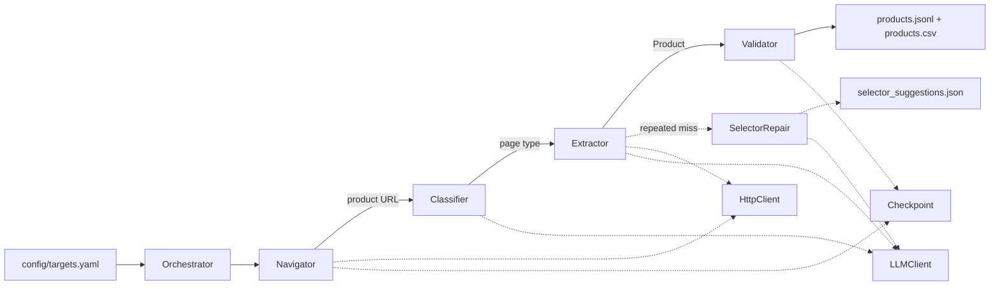
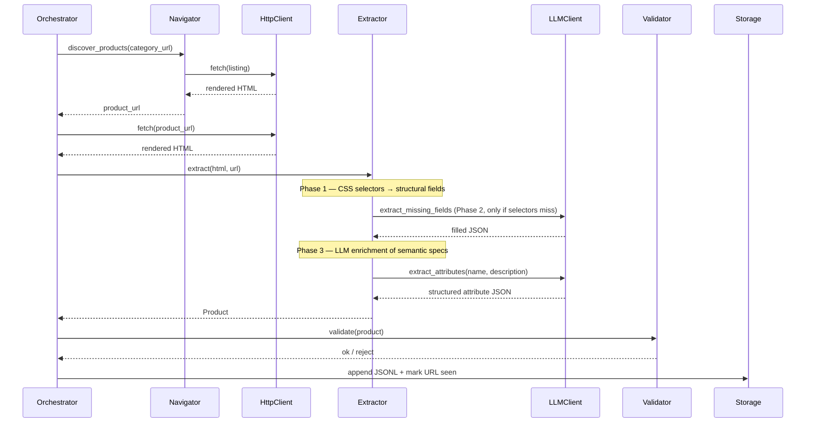

# Frontier Dental — AI Agent Product Scraper (POC)

Take-home test: build an agent-based scraping system that extracts a
structured catalog from [Safco Dental Supply](https://www.safcodental.com/),
with production-minded controls (rate limiting, retries, checkpointing,
observability) and a hybrid extraction strategy — CSS selectors for
structural fields, LLM for semantic enrichment.

**Latest run summary** *(real scrape against the two configured categories,
2026-05-06)*:

| Metric | Value |
|---|---|
| Products extracted | **100** (50 Sutures & Surgical · 50 Dental Exam Gloves) |
| Schema validation | **100% pass**, 0 duplicates |
| Field coverage (name / sku / brand / price / description / image / availability) | **100%** |
| Extraction method breakdown | **83 selector-only · 17 hybrid (LLM-enriched specs)** |
| LLM calls | **100** — one per product for attribute enrichment |
| Avg LLM-extracted attributes per enriched product | **5–7** (material, sterile, form, intended_use, …) |
| Pages crawled | 8 (4 listing pages × 2 categories) + 100 detail pages |

The **selector pass** captures the structural catalog (name, SKU, price,
brand, image, availability). The **LLM enricher** then reads the
free-text description and pulls structured attributes that selectors
cannot extract — the kind of data that powers downstream search and
filtering.

---

## 1. Architecture overview

The orchestrator drives a single async run. Each agent has a narrow
responsibility and a clean async boundary, so implementations can be
swapped (Playwright→httpx, Gemini→Claude) without changing the core
flow.

### 1.1 Component view



Solid arrows are primary data flow; dotted arrows are side calls to
shared infrastructure or async feedback loops.

### 1.2 Sequence — extracting one product

The Extractor runs three internal phases for each product page —
selectors first, then LLM fallback for missing structural fields, then
LLM enrichment of semantic attributes from the description.



**SelectorRepair operates as an offline feedback loop**: when a CSS
selector misses repeatedly across products, it asks the LLM for
replacement suggestions and writes them to a review queue rather than
auto-deploying — a deliberate production-safety choice.

---

## 2. Why I chose this approach

### Hybrid extraction: selectors for structure, LLM for semantics

A naive scraper either (a) regex-and-selector everything, which fails on
unstructured prose, or (b) feeds every page to an LLM, which is slow,
expensive, and non-deterministic. Neither matches the structure of a
real e-commerce catalog, which has both:

- **Structural fields** (name, SKU, price, brand, image URL) — these
  live in deterministic DOM positions on a templated site.
- **Semantic fields** (material, sterility, intended use, pack size,
  …) — these live in free-text description prose.

The system uses the right tool for each:

| Tool | Used for | Calls per product | Determinism |
|---|---|---|---|
| **CSS selectors** | Structural fields | 0 LLM calls | High |
| **LLM enricher** (always-on) | Semantic attributes from description | 1 per product | Medium (LLM, JSON-mode) |
| **LLM extractor fallback** (rare) | Filling missing structural fields when selectors break | 0–1 per product | Medium |
| **LLM selector repair** (rare) | Suggesting new selectors after repeated failures | <0.01 per product | Offline review |

In practice on Safco's well-templated catalog, selectors hit 100% of
structural fields and the enricher adds **structured semantic specs to
17% of products** (whichever ones have rich enough descriptions). The
remaining 83% pass through with selector-only data — proof that the LLM
is invoked only where it earns its keep.

### Playwright over plain HTTP

Safco's catalog is rendered client-side via **Algolia InstantSearch**.
A static `requests.get()` returns an empty `.ais-Hits` container — the
products only appear after JavaScript hydration. Playwright's
`wait_for_selector(".ais-Hits-item")` ensures the rendered DOM is
stable before we read it.

### Pydantic schema as the contract

Every output row passes through `Product.model_validate()`, so a
downstream consumer (DB load, search index, e-commerce frontend) gets
a known shape. Two audit-trail fields make data-quality monitoring
trivial:

- `extraction_method` — `selector` / `hybrid` / `llm_fallback`
- `fields_via_llm` — list of fields that were filled by the LLM

If the share of `hybrid` rows trends up over time, the rule-based
selectors are drifting and the SelectorRepair queue should be triaged.

---

## 3. Agent responsibilities

| Agent | Strategy | LLM use |
|---|---|---|
| **Navigator** | Crawl category page, extract product URLs, walk pagination | None (pure rules) |
| **Classifier** | URL pattern + DOM signals → `category_listing` / `product_detail` / `other` | Fallback when rules are inconclusive |
| **Extractor** | Three phases: (1) CSS selectors for structural fields, (2) LLM fallback for missing structural fields, (3) **LLM enrichment of semantic attributes** from the free-text description into `specifications` (material, color, sterile, form, intended_use, …) | **Phase 3 fires once per product** — primary AI value-add. Phase 2 fires only when selectors miss critical fields. |
| **Validator** | Schema check + dedup by SKU/URL + business rules | None |
| **SelectorRepair** | Tracks per-field selector failures; on threshold, persists candidate replacement selectors for human review | Suggests new CSS selectors |

---

## 4. Setup & execution

```bash
# 1. Clone + venv
git clone <this-repo> && cd "frontier dental test"
python -m venv venv && source venv/Scripts/activate   # Windows: .\venv\Scripts\activate
pip install -r requirements.txt
playwright install chromium

# 2. Configure
cp .env.example .env
# Edit .env and set GEMINI_API_KEY (free tier: https://aistudio.google.com/app/apikey)
# If you skip this, the system runs in pure rule-based mode (no LLM fallback)

# 3. Run scrape
python -m src.main scrape --config config/targets.yaml

# 4. Inspect status
python -m src.main status

# 5. Re-export CSV
python -m src.main export
```

Output lands in:
- `data/output/products.jsonl` — canonical per-product records
- `data/output/products.csv` — flat export
- `data/output/selector_suggestions.json` — SelectorRepair candidates
- `data/checkpoints/seen.json` — resumable URL list
- `logs/run.log` — rotated structured log

A re-run picks up where the previous one left off (URLs in `seen.json`
are skipped). Idempotent on SKU.

---

## 5. Sample output schema

A real row from the latest run, demonstrating LLM enrichment in action.
The `specifications` block was extracted from the product description by
the Enricher — none of those keys were in the source HTML as a structured
spec table.

```json
{
  "name": "Surgifoam",
  "url": "https://www.safcodental.com/product/surgifoam-reg",
  "category_path": ["Sutures & Surgical Products"],
  "brand": "Ethicon",
  "sku": "PFPJK",
  "price": 214.49,
  "currency": "USD",
  "pack_size": null,
  "availability": "in_stock",
  "description": "Sterile, water insoluble, malleable porcine gelatin absorbable sponge, intended for hemostatic use by applying to a bleeding surface. Use in oral surgery for the obliteration of dead space created by simple extraction, root amputation and removal of cysts, tumors and impacted teeth. Rapid hemostasis. Easy to handle: compressible, does not require any cutting. Absorbs up to 40 times its own weight. Bioresorbable. The sponge is porous and off-white in appearance.",
  "specifications": {
    "material": "porcine gelatin",
    "color": "off-white",
    "sterile": "true",
    "absorbable": "true",
    "form": "sponge",
    "texture": "porous",
    "intended_use": "hemostatic"
  },
  "image_urls": [
    "https://www.safcodental.com/media/catalog/product/p/f/pfpjk.jpg?optimize=medium&fit=bounds&height=700&width=700&canvas=700:700"
  ],
  "alternative_skus": [],
  "extracted_at": "2026-05-06T05:01:14.328019+00:00",
  "extraction_method": "hybrid",
  "extraction_confidence": 0.85,
  "fields_via_llm": ["specifications"]
}
```

### Field coverage on the 100-product sample run

| Field | Coverage | Notes |
|---|---|---|
| `name` | 100% | Selector — `h1` |
| `url` | 100% | Provided by Navigator |
| `sku` | 100% | Selector — `form[data-sku]` attribute |
| `brand` | 100% | Selector — `[href*='shop-by-manufacturer'] span` |
| `price` | 100% | Selector — `.price-box .price` |
| `description` | 100% | Selector — `#description` |
| `image_urls` | 100% | Selector — `[itemprop='image']` |
| `availability` | 100% | Schema.org `[itemprop='availability']` href parse |
| `category_path` | 100% | Provided by Navigator (config category name) |
| `specifications` | 17% | LLM enricher (only fires when description has extractable attributes) |
| `pack_size` | 0% | Not exposed structurally; could move to enricher |
| `alternative_skus` | 0% | Related-products carousel not parsed (see Limitations §6) |

CSV mirrors the JSONL schema; nested fields (lists, dicts) are
JSON-encoded so one row = one product.

---

## 6. Limitations

- **`max_products_per_category` cap** in config — keeps the POC bounded
  during the 24h test. Lift for full crawls.
- **No `robots.txt` checker** — production must add this. Safco's
  robots.txt was not blocking on the sampled paths but a real system
  needs explicit compliance.
- **Product variants not modeled** — if one product has size/color
  variants on a single detail page, only the default is captured.
  Real schema would extend `Product` with a `variants: list[Variant]`.
- **No `alternative products` extraction** — the related-products
  carousel on detail pages is not parsed (could be added with another
  selector + child extraction).
- **Single browser context** — for very large crawls you'd want a
  context pool so different sessions don't bleed cookies.
- **LLM cost cap is per-run, not per-budget** — a long-running deployment
  needs a token/dollar budget rather than a call count.
- **No Cloudflare / bot challenge handling** — Safco didn't surface
  one during testing; if introduced, would need stealth playwright +
  proxy rotation.
- **LLM throughput constrained by free-tier quota.** The sample run
  was executed against the Gemini 2.5 Flash free tier, which caps
  daily requests at the project level. The pipeline self-paces at
  ~13 RPM (one call every 4.5s) to stay under the per-minute limit,
  and the daily cap was reached during this POC. The architecture
  degrades gracefully — when an LLM call hits 429, the extractor
  falls back to selector-only data and the product is still emitted
  with `extraction_method = "selector"`. Production deployment would
  use the paid tier (no daily cap, higher RPM) or a token-bucket
  rate limiter sized to the actual quota.

---

## 7. Failure handling

| Failure | Detection | Response |
|---|---|---|
| Network / 5xx | Tenacity exception | Exponential-backoff retry up to `crawler.retries` |
| `wait_for_selector` timeout | Logged; HTML still captured | Extractor may still find data; if not, LLM fallback engages |
| Selector miss for one field | `_first_text` returns None | LLM fallback (extractor) requested for that field |
| Selector miss across many pages | `SelectorRepair.record_failure` count | After threshold, repair agent suggests replacement selector to JSON file |
| Pydantic validation reject | Caught in extractor, logged | Product dropped, URL still checkpointed (won't retry the bad page in the next run) |
| LLM call cap reached | Counter check | Returns empty dict, downstream proceeds with whatever selectors got |
| Crash mid-run | `CheckpointStore` is flushed atomically per URL | Rerun resumes from last checkpoint |

---

## 8. How to scale to full-site crawling in production

1. **Distributed queue.** Replace the single in-process navigator with
   Redis (or SQS) holding the URL frontier. Multiple workers pop
   URLs concurrently.
2. **Sharded checkpoint.** Move `seen.json` into Postgres or DynamoDB
   keyed by URL hash for O(1) `is_seen` across workers.
3. **Browser pool.** Run `N` Playwright contexts behind a pool — most
   real sites tolerate 5–10 concurrent connections from a single
   crawler IP.
4. **Proxy rotation.** Add a residential / datacenter proxy pool to
   spread the load. Respect each site's terms.
5. **Schedule.** Wrap each category run as an Airflow / Dagster task
   with cron schedule. Differential crawl (only re-fetch products
   whose `last-modified` advanced or whose dependent pages changed)
   keeps cost down.
6. **Storage upgrade.** JSONL → Postgres for queryability + a vector
   index (e.g. FAISS or pgvector) on product embeddings for
   semantic-search powered downstream features.
7. **Selector versioning.** SelectorRepair candidates land in a
   review queue (not auto-deployed). A human approves; the new
   selector is committed; CI runs regression tests against a sample
   of historical pages.
8. **Observability.** Emit per-page metrics to Prometheus
   (latency, status, selector hit rate, LLM fallback rate, validation
   reject reasons). Alert on field-coverage drops.

---

## 9. How to monitor data quality

- **Schema validation pass rate.** Pydantic rejects per 1000 rows.
  Trends up → site format changed.
- **Per-field coverage.** `% rows with non-null sku`, `% with price`,
  etc. A sudden drop signals selector breakage.
- **LLM fallback rate.** If the proportion of `extraction_method =
  hybrid` or `llm_fallback` rises, the rule-based selectors are
  drifting. SelectorRepair suggestions tell you where.
- **Validator dedup rate.** Spike in `rejected_duplicate` may indicate
  pagination issues (same products on multiple pages).
- **Distribution drift.** Track price quantiles, image-count
  distribution, brand frequency. A sharp shift in any of these vs.
  the prior run = either site changed or our extractor is buggy.
- **Sample audits.** Random-sample N rows per run for human review
  against the live site. Catches silent semantic errors (e.g. brand
  field accidentally getting category name).

All of the above can be a single dashboard / Slack alert based on
parsing the JSONL output and the validator/LLM call summary.

---

## 10. Project structure

```mermaid
graph TD
    Root["frontier dental test/"]
    Root --> CfgDir[config/]
    Root --> SrcDir[src/]
    Root --> TestsDir[tests/]
    Root --> TopFiles["README.md / requirements.txt / .env.example / .gitignore"]

    CfgDir --> targets["targets.yaml — URLs, selectors, rate limits, LLM toggles"]

    SrcDir --> Main["main.py — Typer CLI: scrape / status / export"]
    SrcDir --> SCfg["config.py — Pydantic config models + YAML loader"]
    SrcDir --> Orch["orchestrator.py — ties agents, manages async run"]
    SrcDir --> AgentsDir[agents/]
    SrcDir --> HttpDir[http/]
    SrcDir --> ModelsDir[models/]
    SrcDir --> StorageDir[storage/]
    SrcDir --> LLMDir[llm/]

    AgentsDir --> Nav["navigator.py — URL discovery + pagination"]
    AgentsDir --> Cls["classifier.py — page-type detection"]
    AgentsDir --> Ext["extractor.py — selectors + LLM fallback + LLM enrichment"]
    AgentsDir --> Val["validator.py — schema + dedup + business rules"]
    AgentsDir --> Rep["selector_repair.py — LLM-assisted selector suggestions"]

    HttpDir --> HCli["client.py — async Playwright, retry, rate-limit"]
    ModelsDir --> Prod["product.py — Pydantic Product schema"]
    StorageDir --> Chk["checkpoint.py — resumable seen-URLs store"]
    StorageDir --> Writer["writer.py — JSONL writer + CSV exporter"]
    LLMDir --> LCli["client.py — Gemini 2.5 Flash + NullLLMClient"]

    TestsDir --> TestExt["test_extractor.py"]
    TestsDir --> TestEnr["test_extractor_enrichment.py"]
```



Runtime artifacts (gitignored): `data/output/` (products.jsonl, products.csv),
`data/checkpoints/seen.json`, `data/raw_html/`, `logs/run.log`.

Run tests:
```bash
pytest -v tests/
```
